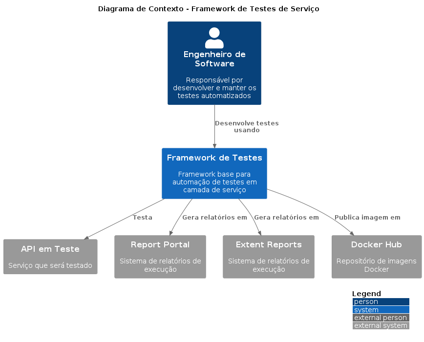
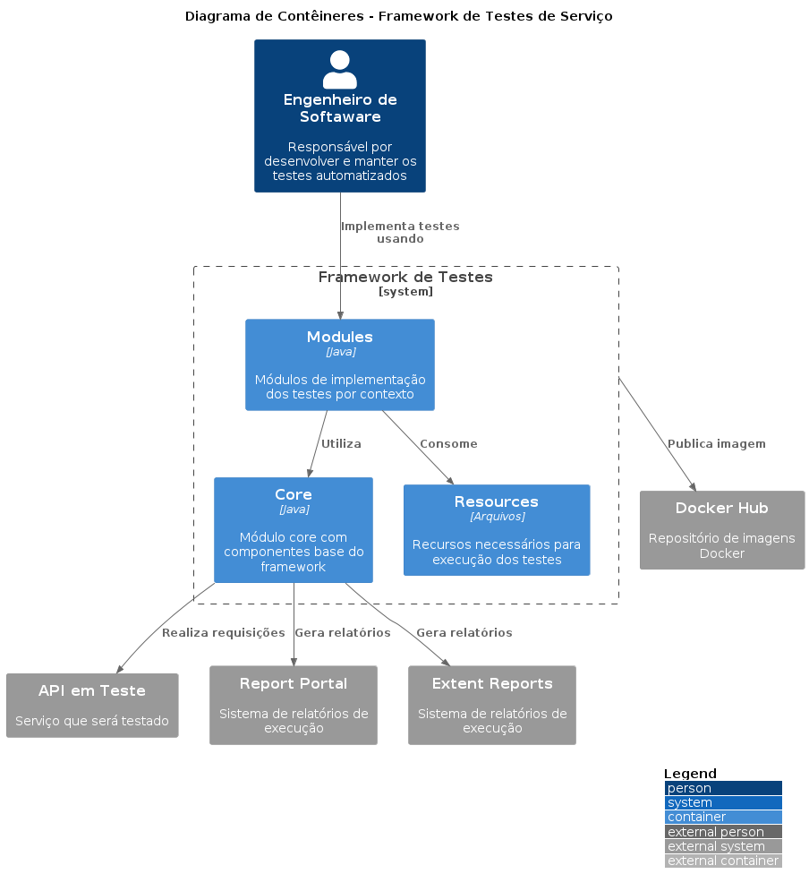
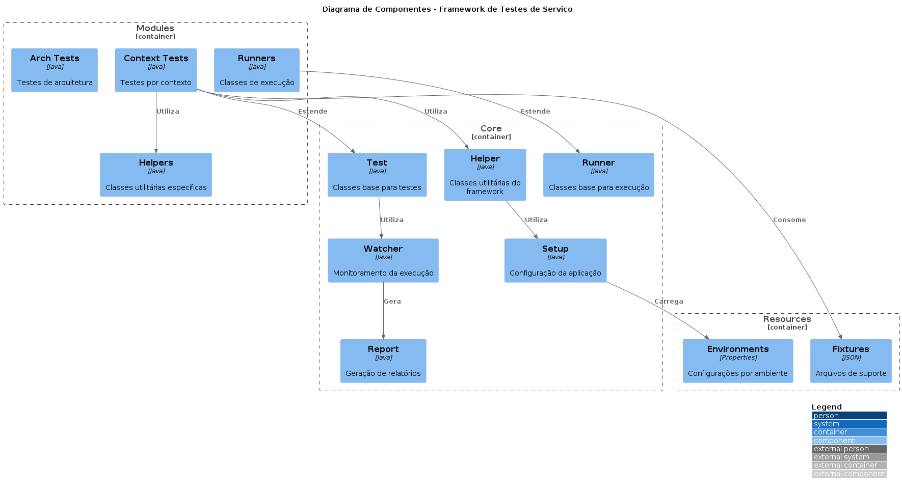
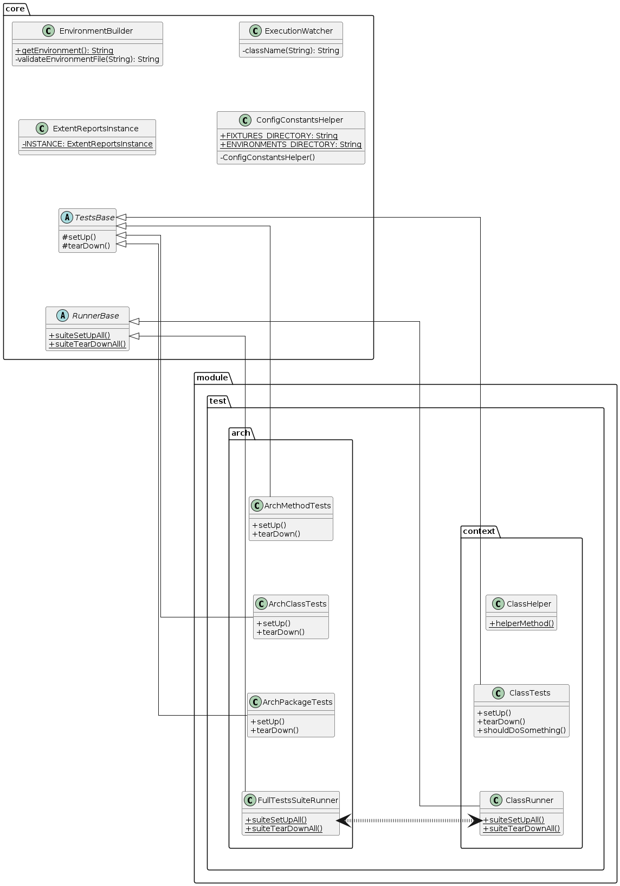
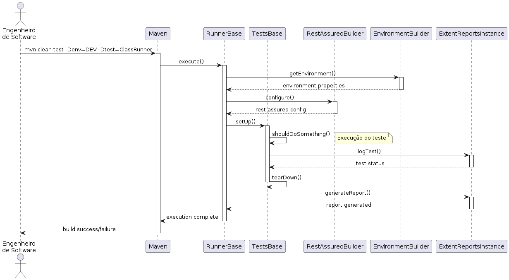

# test-service-architecture-example

Projeto base de exemplo para automações de testes em camada de serviço desenvolvido com Java + RestAssured e integrado com recursos de relatório (Extent Reports) para acompanhamento de resultados.

## Tecnologias
* [Java](https://openjdk.org/)
* [RestAssured](https://rest-assured.io/)
* [ExtentReports](https://extentreports.com/)

## Estrutura

### Arquitetura base e configuração

```
📦 test-service-architecture-example
├──	📜 .gitignore
├──	📜 README.md
├── 📜 pom.xml
├── 📂 core
|	├── 📜 pom.xml
|	└── 📂 src/test/java
|		├── 📂 br.com.qa.test.service.core.helper
|		|	├── 📜 ConfigConstantsHelper.java
|		|	├── 📜 EnvironmentBuilder.java
|		|	├── 📜 JsonBuilder.java
|		|	└── 📜 RestAssuredBuilder.java
|		├── 📂 br.com.qa.test.service.core.report
|		|	├── 📜 ExtentReportsBase.java
|		|	└── 📜 ExtentReportsInstance.java
|		├── 📂 br.com.qa.test.service.core.runner
|		|	└── 📜 RunnerBase.java
|		├── 📂 br.com.qa.test.service.core.setup
|		|	└── 📜 ApplicationProperties.java
|		├── 📂 br.com.qa.test.service.core.test
|		|	└── 📜 TestsBase.java
|		└── 📂 br.com.qa.test.service.core.watcher
|			└── 📜 ExecutionWatcher.java
└── 📂 modules
```

**test-service-architecture-example:** Repositório raiz do projeto.

**.gitignore:** Arquivo utilizado para ignorar arquivos e pastas no versionamento de código.

**README.md:** Arquivo de orientações base do projeto.

**pom.xml:** Arquivo de configuração do projeto Maven.

**core:** Diretório que mantém o núcleo do framework de testes.

- **helper:** Diretório com classes utilitárias do framework.
  - ConfigConstantsHelper: Constantes de configuração.
  - EnvironmentBuilder: Construtor de ambiente.
  - JsonBuilder: Manipulador de JSON.
  - RestAssuredBuilder: Configurador do RestAssured.
- **report:** Classes responsáveis pela geração de relatórios.
- **runner:** Classes base para execução dos testes.
- **setup:** Classes de configuração da aplicação.
- **test:** Classes base para implementação dos testes.
- **watcher:** Classes para monitoramento da execução.
- **modules:** Diretório que mantém as implementações dos testes por contexto.

**modules:** Diretório que mantém as implementações dos testes por contexto.

### Arquitetura de testes

```
📦 test-service-architecture-example
...
└── 📂 modules
	├── 📜 pom.xml
	├── 📂 src/test/java
...
	|	├── 📂 module.test.arch.helpers
	|	|	└── 📜 ContextConstantsHelper.java
	|	├── 📂 module.test.arch.runners
	|	|	├── 📜 ArchTestsSuiteRunner.java
	|	|	└── 📜 FullTestsSuiteRunner.java
	|	├── 📂 module.test.arch.tests
	|	|	├── 📜 ArchClassTests.java
	|	|	├── 📜 ArchMethodTests.java
	|	|	└── 📜 ArchPackageTests.java
...
	|	|
	|	├── 📂 module.test.context.x.helpers
	|	|	├── 📜 AccountHelper.java
	|	|	├── 📜 DateHelper.java
	|	|	├── 📜 TransactionDTO.java
	|	|	└── 📜 TransactionHelper.java
	|	├── 📂 module.test.context.x.runners
	|	|	├── 📜 ContextXFullSuiteRunner.java
	|	|	└── 📜 ContextXPartialSuiteRunner.java
	|	├── 📂 module.test.context.x.tests
	|	|	├── 📜 AccountTests.java
	|	|	├── 📜 AuthenticationTests.java
	|	|	├── 📜 BalanceTests.java
	|	|	└── 📜 TransactionsTests.java
	|	|
...
	└── 📂 src/test/resources
		├── 📂 environments
		|	├── 📜 dev-application.properties
		|	└── 📜 stg-application.properties
		└── 📂 fixtures
			├── 📂 payload
			|	├── 📜 create-user-success.json
			|	├── 📜 system-register-error.json
			|	├── 📜 system-register-success.json
			|	└── 📜 update-user-success.json
			└── 📂 schema
				├── 📜 create-user-schema.json
				├── 📜 fail-system-register-schema.json
				└── 📜 system-register-schema.json
```

**module.test.arch.helpers:** Módulo compartilhado de classes utilitárias (geral).

**module.test.arch.runners:** Módulo compartilhado de classes de execução dos testes (geral).

**module.test.arch.tests:** Módulo compartilhado de classes de testes de arquitetura (geral).

**module.test.context:** Módulo de contexto utilizado para implementação dos testes.

- **helpers:** Classes utilitárias específicas do contexto.
- **runners:** Classes de execução de testes do contexto.
- **tests:** Classes de teste do contexto.

**resources:** Recursos necessários para execução dos testes.

- **environments:** Arquivos de propriedades por ambiente.
- **fixtures:** Arquivos de suporte aos testes.

### Modelagem

#### C4 - Contexto



#### C4 - Contêineres



#### C4 - Componentes



#### C4 - Código

##### Diagrama de Classes



##### Diagrama de Sequência



## Utilizando o projeto

### Recursos do projeto

Toda configuração base do projeto de exemplo já esta realizada, não sendo necessário nenhuma ação de código para verificar seu funcionamento.

#### JUnit

O [JUnit](https://junit.org/) é um framework de testes unitários para Java que oferece recursos robustos para organização e execução de testes automatizados. Através de suas anotações (@Test, @Before, @After), permite estruturar os testes de forma clara e executá-los de maneira controlada.

No projeto, é utilizado principalmente para organização das suítes de teste (@RunWith, @SuiteClasses) e gerenciamento do ciclo de vida dos testes com recursos como @BeforeClass e @AfterClass.

#### ArchUnit

O [ArchUnit](https://www.archunit.org/) é uma biblioteca Java que permite testar a arquitetura do seu código através de regras definidas em testes unitários. Oferece uma API fluente para verificar dependências entre pacotes e classes, validar convenções de nomenclatura, garantir princípios de design e impor restrições arquiteturais.

No projeto, é utilizado para garantir que a estrutura do código siga os padrões estabelecidos e mantenha a integridade arquitetural ao longo do desenvolvimento.

#### Rest Assured

O [Rest Assured](https://rest-assured.io/) é uma biblioteca Java que simplifica o processo de teste de APIs REST. Oferece uma DSL fluente para construção de requisições HTTP, permitindo validar respostas, headers, status codes e corpo das mensagens de forma intuitiva e expressiva.

#### JSON Schema Validator

O [JSON Schema Validator](https://mvnrepository.com/artifact/io.rest-assured/json-schema-validator) é uma ferramenta que permite validar a estrutura e formato de arquivos JSON contra um esquema predefinido. Com ele, é possível garantir que os dados JSON retornados pela API estejam em conformidade com a estrutura esperada, validando tipos de dados, formatos, campos obrigatórios e regras de validação customizadas.

#### Extent Reports

O [Extent Reports](https://extentreports.com/) é um framework de relatórios que gera documentação detalhada e visualmente atraente dos resultados dos testes. Permite criar relatórios HTML interativos com informações sobre execução, logs, screenshots e métricas de teste, facilitando a análise e acompanhamento dos resultados.

#### Report Portal

TBD.

### Executando o projeto

Antes de começar, verifique que as seguintes tecnologias estão disponíveis em sua estação de trabalho:

- Git
- Java (Versão LTS)
- Maven

Para gestão de recursos do Java, é recomendado o uso do SDKMAN!. Caso esteja utilizando Windows, é possível instalá-lo via WSL ou por esse [tutorial (sem WSL)](https://notfounnd.medium.com/hacks-de-qa-como-configurar-um-ambiente-multi-java-no-windows-252a7bf73870).

Para realizarmos a execução local devemos primeiramente realizar o clone do projeto:

```bash
git clone https://github.com/notfounnd/project-java-junit-rest-assured-extent-reports.git
```

Após finalizar o clone, posicione o terminal na pasta raiz do projeto que você baixou e execute os testes com o comando CLI do Maven, conforme o modelo a seguir:

```bash
mvn clean test -am -amd -Denv=DEV -Dtest=FullTestsSuiteRunner
```

- `mvn` - Invoca o Maven para execução.
- `clean` - Limpa diretórios de build anteriores.
- `test` - Executa a fase de testes do ciclo de vida Maven.
- `-am` - Constrói os projetos dos quais este depende.
- `-amd` - Constrói os projetos que dependem deste.
- `-Denv=DEV` - Define o ambiente onde os testes serão executados.
- `-Dtest=FullTestsSuiteRunner` - Define qual classe executora de testes será utilizada.

Também é possível utilizar outras classes executoras no projeto, abrindo opção para que o desenvolvedor do teste defina suítes customizadas para cada contexto.

```bash
# Executa todos os testes do contexto X
mvn clean test -am -amd -Denv=DEV -Dtest=ContextXFullSuiteRunner

# Executa parte dos testes do contexto X e do contexto Y
mvn clean test -am -amd -Denv=DEV -Dtest=ContextXPartialSuiteRunner,ContextYPartialSuiteRunner
```

### Extent Reports

Durante a execução dos testes, o framework gera automaticamente relatórios detalhados na pasta target do submódulo onde os testes são desenvolvidos. O Extent Reports captura informações importantes de cada teste executado, incluindo status de execução, tempo decorrido, logs e eventuais falhas.

Os relatórios são gerados em formato HTML e podem ser acessados após a conclusão da execução dos testes. O arquivo principal do relatório apresenta um dashboard interativo com métricas gerais e permite navegar pelos detalhes de cada teste executado, facilitando a análise dos resultados e a identificação de possíveis problemas.

Para visualizar os relatórios, basta acessar o arquivo HTML gerado na pasta após a execução dos testes.

- ./modules/target/report/results-report.html

### Report Portal

TBD.

## Manutenção do projeto de testes

### Regras de convenção de arquitetura

#### Pacotes

- Pacotes devem ser nomeados respeitando o padrão de sufixos estabelecidos.
  - Finalizados com .helpers / .runners / .tests para compor a nomenclatura do pacote.

#### Classes

- Classes no pacote runners devem ser nomeadas com o sufixo "Runner".
- Classes no pacote runners devem estender a classe RunnerBase.
- Classes no pacote tests devem ser nomeadas com o sufixo "Tests".
- Classes no pacote tests devem estender a classe TestsBase.

#### Métodos

- Métodos de teste devem começar com o prefixo "should".
  - Não se aplica aos métodos de setUp e tearDown.
- Métodos que começam com "should" devem ter a anotação @Test.
- Métodos com anotação @Before devem ser nomeados como "setUp".
- Métodos com anotação @After devem ser nomeados como "tearDown".

### Executando testes de arquitetura

Para validar se a estrutura dos testes desenvolvidos está seguindo a arquitetura definida, basta executar o seguinte comando:

```bash
 mvn clean test -am -amd -Dtest=ArchTestsSuiteRunner -Denv=DEV
```
